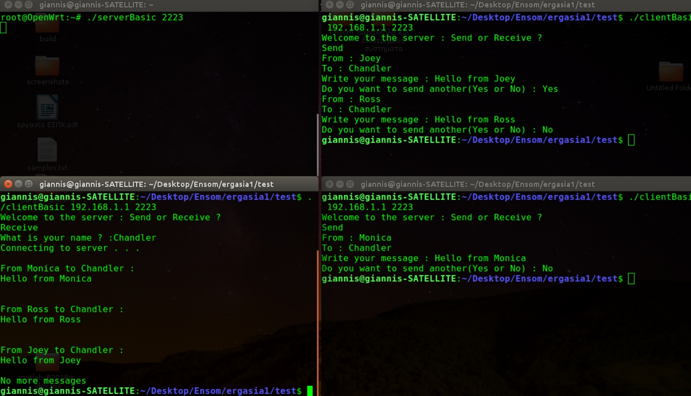

# ZSun Server Design and Test 


## Introduction

This project illustrates how to build a simple client-server setup on the ZSun embedded device, originally intended as a WiFi SD card reader. With custom firmware like OpenWRT, the ZSun becomes a versatile embedded platform. The provided C code demonstrates basic networking tasks and serves as a foundation for further development. The project was developed during a course in Real-Time Embedded Systems.

## Project Files Description 

 - __clientBasic.c:__ Simple client to communicate with the server
 - __serverBasic.:__ Simple server code to manage client requests
 - __serverv2.c:__ Enhanced server with improved features.

## Explanation of serverBasic.c

The __serverBasic.c__ code is designed with key features like threading for connections and a linked list to store messages. The threads managing connections are implemented using pthreads.

__Connection Handling:__ In an infinite loop, the server waits for incoming connections. Once accepted, the new socket descriptor is stored in newSock for use in a thread. A new thread is created using `pthread_create`.

__Thread Execution:__ The thread executes the handler function, which takes newSock as an argument. Depending on user commands (Send or Receive), it performs the appropriate actions:

- __Send:__ Asks for username, message's recipient and content, stores this in a message structure, and uses a mutex to add the message to the linked list. It repeats until the user stops sending messages, then disconnects.
- __Receive:__ Requests the client's username and uses a mutex to search for relevant messages in the linked list. The handler function retrieves and sends the messages to the client, then removes them from memory using `deleteNode` and disconnects.

__Search Function:__ Scans the linked list to find all messages intended for a given user. Each message increases `sizeofMessage` by a specific size, resulting in the total byte size of the data to be sent to the client. This information is used to create the `completeMessage` array, which contains all messages concatenated into a data stream. The function also adds "No more messages" to indicate the end. If no messages are found, 0 is returned to signal this to the client.

Important aspects of the implementation include:

__Linked Lists for Storage:__ Linked lists were used because they are well-suited for frequently added and deleted data. An array would consume significantly more memory and processing time for access and comparison, increasing energy consumption.

__Accurate Messaging:__ Sender/receiver information is managed via the struct `input`, ensuring no incorrect messages are delivered since messages are deleted immediately after being sent.

__Concurrent Connections:__ The server can handle multiple connections concurrently through the use of `pthreads`.

__Message Size Limitation:__ The system limits message sizes to 768 bytes

__Fair Server Usage:__ Fair use of the server is ensured through `listen`, which internally implements a priority queue to manage incoming connections.
## Explanation of clientBasic.c

The code aligns with the server logic and includes clear comments. Special attention is given to the Receive command:

__Receive Handling:__ The client first receives the total message size from the server, allocates a buffer, and reads the complete data stream from the server. If the size is 0, it prints "No more messages for you."
## Setting Up ZSun for OpenWRT

To set up OpenWRT on the ZSun, I followed [this](https://martaver.github.io/projects/hack-zsun-for-openwrt-captive-portal-part-1/) guide. The key steps included:

__Install libpthread:__ Loading libpthread.so.0 onto the ZSun for pthreads support.

__Compile Server Code:__ Using gcc in the openwrt-zsun/zsun/staging_dir/toolchain-mips_mips32_gcc-4.8-linaro_uClibc-0.9.33.2/bin folder, I compiled `serverBasic.c`.

__Transfer Executable:__ The server binary was transferred to the ZSun with: 
```
scp serverBasic root@192.168.1.1:~/serverBasic
``` 
after establishing SSH access for remote control with: 
```
ssh root@192.168.1.1.
```

This process was repeated for all executable files to ensure proper deployment.
## Demonstrating the Server-Client System

__Starting the Server:__ The serverBasic executable is uploaded to the ZSun and launched with the command:

```
./serverBasic 2223
```

__Connecting Clients:__ Three clients are started on separate terminals on the computer, each connecting to the server at 192.168.1.1 on port 2223 using:

```
./clientBasic 192.168.1.1 2223
```
At this point, the system setup is as follows:


**Sending Messages:** Two messages are sent from the upper-right user and one from the bottom terminal ones:


**Closing Clients:** All three users select "No" to close their terminals. A new client is started in the bottom-left terminal to read messages:



**Attempting to Read Deleted Messages:** A new client in the bottom-right terminal attempts to read the same messages, but they have already been deleted from the server:


**Reading Remaining Messages:** The remaining messages are read from the bottom-left terminal:


## Performance and CPU Usage Analysis

The following steps were taken to measure speed and CPU usage:

__Six Clients:__ Using OpenMP, six clients were created to send messages continuously to the server.

__Server Execution:__ The server ran on the ZSun using `./serverv2 2223`.

__Monitoring Load:__ The server on the ZSun counted received messages with a numbers variable. Every 1,000 messages, it executed `uptime` to log the load average.

__CPU Load Average:__ The 5-minute load average was collected as an indicator of CPU usage. Any value above 1 suggests high CPU usage since the ZSun has a single processor.

Below is an illustrative screenshot of the server running on the ZSun while concurrently processing messages from six clients (run `./client 192.168.1.1 2223`):


### Key Observations
__Consistent Message Processing:__ The processing time for 1,000 messages remained steady (about 2-3 seconds), as six threads were consistently looping. However, the CPU load varied due to the message storage operations.

__Graph Analysis:__ Using the data collected from handling up to 30,000 messages, the following graph was generated after processing in MATLAB:


__Load Trend Analysis:__ The graph shows a gradual increase in load average as the message count rises. The range between 15,000 and 25,000 messages is particularly interesting because the 15-minute load average remains relatively stable, indicating consistent CPU load during this period.

__Efficiency Ratio:__ The ratio of (Number of Messages) / (CPU Load) is plotted below:


__Optimal Load Range:__ In the range of 15,000 to 25,000 messages, there's a noticeable improvement in efficiency, meaning message processing per CPU load unit increases significantly. If the load average is considered an indicator of power consumption (due to increased CPU demand under heavy load), this range represents optimal performance with the best message-to-power ratio.

__Message Transmission Time:__ By creating multiple instances of `clientBasic` and running them sequentially, the following results were obtained, showing the average message transmission time:


The average message transmission time was `0.0716` milliseconds, indicating swift and efficient communication.